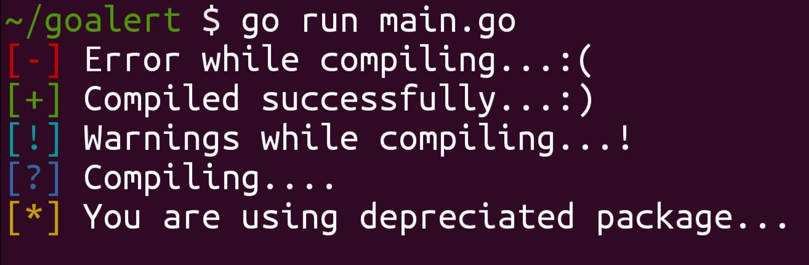
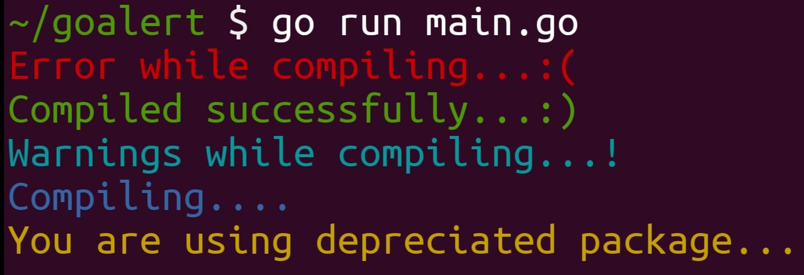

# goalert
goalert is a Go package that allows users to display colorful alerts and messages on their terminal.
It allows users to easily highlight important information or display error messages in a visually appealing way.

One of the key features of goalert is its support for different types of alerts, such as success, error, warning, and info.
Each type of alert is displayed with a different color and style, making it easy for users to differentiate between them.
The package also provides a set of default colors and styles for each type of alert, but users can easily customize them to suit their needs.

Using goalert is straightforward.
Users simply need to import the package into their Go file and use the functions to display an alert.
They can specify the type of alert they want to display, and goalert will take care of formatting and displaying the alert with the appropriate color and style.

Contributions to goalert are welcome, whether it's reporting issues, suggesting improvements, or submitting pull requests.
The project is open-source and licensed under the MIT License, which means users are free to use, modify, and distribute it.

Overall, goalert provides a simple and flexible solution for displaying alerts and messages on the terminal in a visually appealing way. Its easy integration and customization options make it a valuable tool for Go developers who want to enhance the user experience of their command-line applications.

## Features
- Display alerts and messages with different colors and styles
- Supports various types of alerts, such as success, error, warning, and info
- Customizable colors and styles for each type of alert
- Easy to use and integrate into your Go projects
- Colorize text.

## Installation
1. To install goalert, you need to have Go installed and set up on your machine. 
2. Then, run the following command:
```bash
go get -u github.com/dev-bittu/goalert
```

## Usage
Import the goalert package into your Go file:
```go
import (
  alert "github.com/dev-bittu/goalert/v1"
)
```

### Displaying Alerts
You can display alerts using the different-different function.
Here's an example:
```go
package main

import (
  alert "github.com/dev-bittu/goalert/v1"
)

func main() {
  alert.Success("Program compiled... :)")
}
```

### Available Alert Types
- alert.Success : Success alert
```go
func Success(text string) {}
```
- alert.Error : Error alert
```go
func Error(text string) {}
```
- alert.Warn : Warning alert
```go
func Warn(text string) {}
```
- alert.Info : Information alert
```go
func Info(text string) {}
```
- alert.Impo : Important alert
```go
func Impo(text string) {}
```

## Example
```go
package main

import(
  alert "github.com/dev-bittu/goalert/v1"
)

func main() {
  alert.Error("Error while compiling...:(")
  alert.Success("Compiled successfully...:)")
  alert.Warn("Warnings while compiling...!")
  alert.Info("Compiling....")
  alert.Impo("You are using depreciated package...")
}
```


### Displaying Colorful Text
You can display colorful text using the different-different function.
Here's an example:
```go
package main

import (
  "fmt"
  alert "github.com/dev-bittu/goalert/v1"
)

func main() {
  text := alert.Green("Program compiled... :)")
  fmt.Println(text)
}
```

### Available Alert Types
- alert.Success : Success alert
```go
func Success(text string) string {}
```
- alert.Error : Error alert
```go
func Error(text string) string {}
```
- alert.Warn : Warning alert
```go
func Warn(text string) string {}
```
- alert.Info : Information alert
```go
func Info(text string) string {}
```
- alert.Impo : Important alert
```go
func Impo(text string) string {}
```

## Example
```go
package main

import(
  "fmt"
  alert "github.com/dev-bittu/goalert/v1"
)

func main() {
  fmt.Println(alert.Red("Error while compiling...:("))
  fmt.Println(alert.Green("Compiled successfully...:)"))
  fmt.Println(alert.Cyan("Warnings while compiling...!"))
  fmt.Println(alert.Blue("Compiling...."))
  fmt.Println(alert.Yellow("You are using depreciated package..."))
}
```


## Contributing
Contributions are welcome!
If you find any issues or have suggestions for improvements, please open an issue or submit a pull request.

## License
This project is licensed under the [MIT License](LICENSE).
